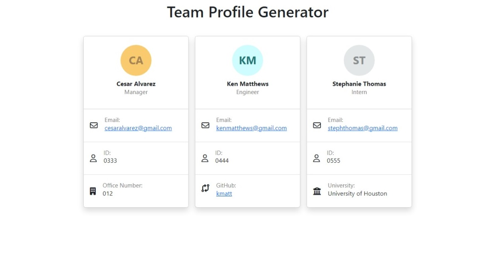

# team-profile-generator

## Preview

Link to the video demonstration:
https://drive.google.com/file/d/1yFTHyxLbU1KigzJ9inEjDCzxqCs5E6Iy/view

## Summary

The goal of this assignment was to get familiar with Node.js and the packages that can be installed to accomplish various tasks. The inquirer package is used to prompt questions in the command line to the user. The fs package is used to write the HTML file in the dist folder, and the jest package was used to practice very basic testing techniques. Outside of Node, Bootstrap was used to provide the basic styling for the employee cards. 

The template design.

## Installation

- Clone the respository locally
- Install the required packages, inquirer and jest. 
- Run "npm test" to test.
- Run "node index.js" to start the program.

